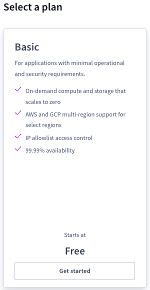
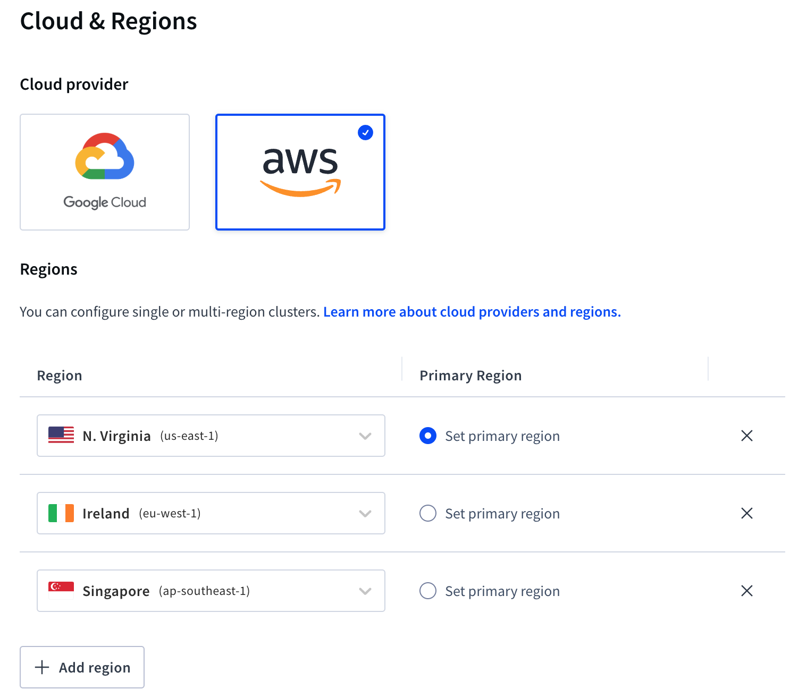
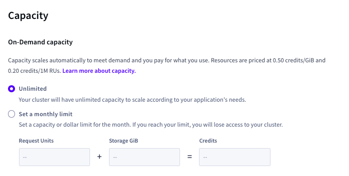
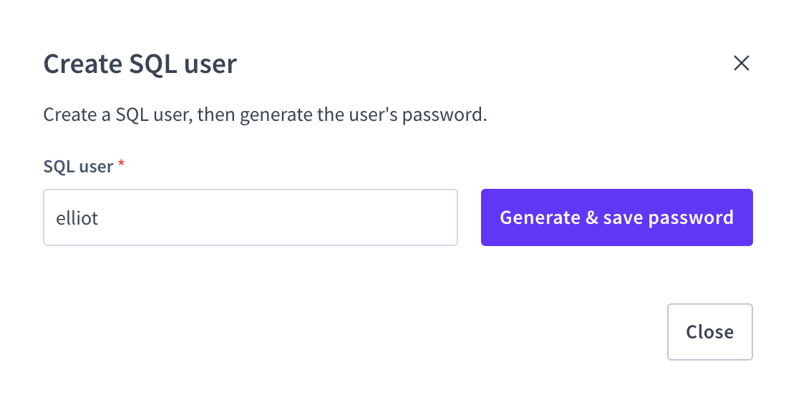
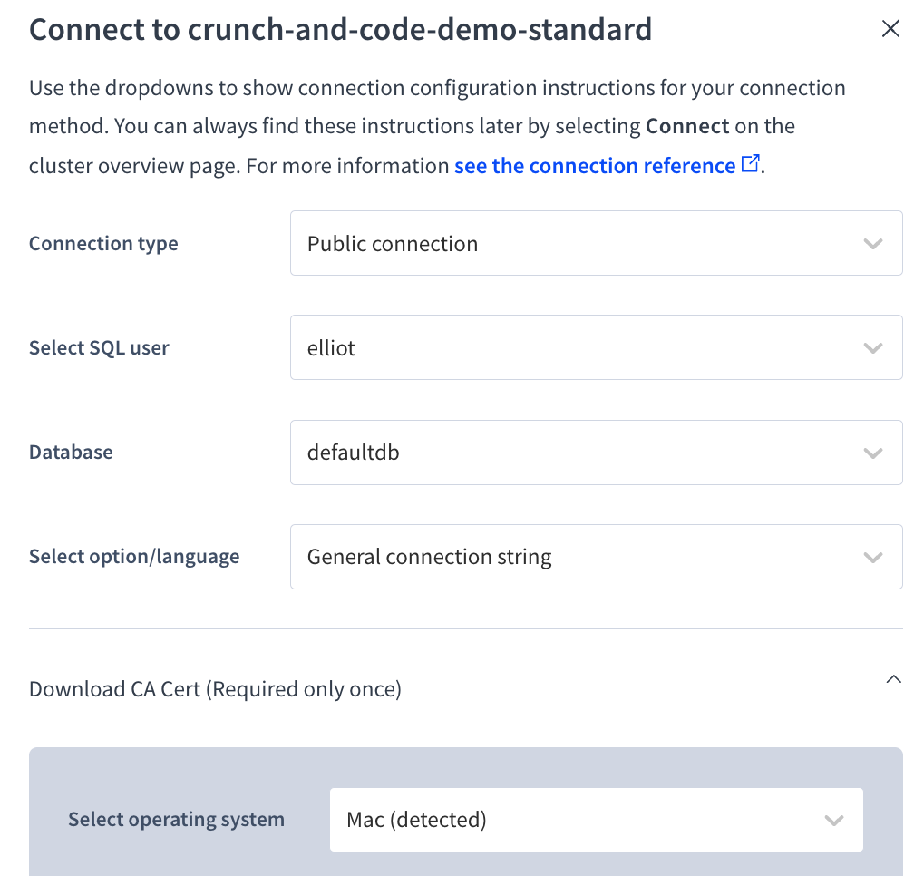
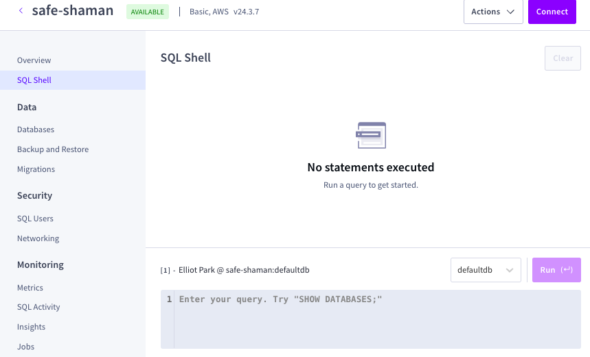

# Crunch & Code: CockroachDB Global User Database Challenge 🌎
Welcome to the CockroachDB Global User Database Challenge!

The objective is to configure a multi-region user database that demonstrates data locality and regional survivability.


## Prize 💵
**$300 USD** for the highest score.

## Challenge Overview
Transform a user database into a global system by implementing data locality that:
- Routes user data to a specific region
- Survives regional failures


## Prerequisites
- [Registration](https://docs.google.com/forms/d/e/1FAIpQLSdfG-23NPmiWGELBjlEGl3J43eGkEBnKPMRqRxdAraEi5Fmmw/viewform)
- GitHub account
- Basic SQL knowledge
- [CockroachDB Cloud](https://cockroachlabs.cloud/)


## Getting Started

### 1. Initial Setup
1. Create a Github repository named "CockroachDB-<em>First and Last Initial</em>."
    - e.g. Joe Smith's Github Repo is "CockroachDB-JS"
2. Create a [CockroachDB Cloud](https://cockroachlabs.cloud/) account

### 2. Useful Documentation
- [CockroachDB Quickstart Guide](https://www.cockroachlabs.com/docs/cockroachcloud/quickstart)
- [Table Localities Documentation](https://www.cockroachlabs.com/docs/stable/table-localities)
- [Regional Tables](https://www.cockroachlabs.com/docs/stable/regional-tables)
- [Global Tables](https://www.cockroachlabs.com/docs/stable/global-tables)
- [Multi-Region Survival Goals](https://www.cockroachlabs.com/docs/stable/multiregion-survival-goals)
- [EXPLAIN ANALYZE Documentation](https://www.cockroachlabs.com/docs/stable/explain-analyze)


## Setup

### 1. Cluster Configuration
- Set up a [CockroachDB Cloud](https://cockroachlabs.cloud/) **Basic** cluster
- CockroachDB Basic comes with 50 million Request Units and 10 GiB of storage for free per month
- The free tier provides ample Request Units to complete the entire coding challenge without exceeding limits

<kbd>
    
</kbd>

#### Cloud Provider:
AWS

#### Multiple Regions
- North Virginia, USA (Set Primary Region)
- Singapore
- Ireland

<kbd>
    
</kbd>

#### Capacity
- Select Unlimited

<kbd>
    
</kbd>

#### Accessing
1. **Cluster Provisioning**:
Wait 1-2 minutes for the cluster to be created

2. **SQL User Setup**:
   - Go to CockroachDB Console → SQL Users
   - Create and save SQL user credentials

<kbd>
    
</kbd>

<br>

3. **Connection Configuration**:
   - You can close this page because you will use the SQL Shell inside the console to execute SQL commands

<kbd>
    
</kbd>

<br>

### 2. Database Setup
Access the SQL Shell in CockroachDB Console:

<kbd>
    
</kbd>

<br>

Execute the following commands to set up your database:

1. Create database:
```sql
CREATE DATABASE IF NOT EXISTS users;
```
2. Select database:
```sql
USE users;
```
3. Create tables:
```sql
CREATE TABLE global_users (
    id UUID PRIMARY KEY DEFAULT gen_random_uuid(),
    name STRING NOT NULL,
    email STRING UNIQUE NOT NULL,
    city STRING NOT NULL,
    country STRING NOT NULL,
    created_at TIMESTAMP DEFAULT current_timestamp(),
    CONSTRAINT email_valid CHECK (email ~* '^[A-Za-z0-9._%+-]+@[A-Za-z0-9.-]+\.[A-Za-z]{2,}$')
);

CREATE TABLE regional_users (
    id UUID PRIMARY KEY DEFAULT gen_random_uuid(),
    name STRING NOT NULL,
    email STRING UNIQUE NOT NULL,
    city STRING NOT NULL,
    country STRING NOT NULL,
    created_at TIMESTAMP DEFAULT current_timestamp(),
    CONSTRAINT email_valid CHECK (email ~* '^[A-Za-z0-9._%+-]+@[A-Za-z0-9.-]+\.[A-Za-z]{2,}$')
);

CREATE TABLE regional_by_row_users (
    id UUID PRIMARY KEY DEFAULT gen_random_uuid(),
    name STRING NOT NULL,
    email STRING UNIQUE NOT NULL,
    city STRING NOT NULL,
    country STRING NOT NULL,
    created_at TIMESTAMP DEFAULT current_timestamp(),
    CONSTRAINT email_valid CHECK (email ~* '^[A-Za-z0-9._%+-]+@[A-Za-z0-9.-]+\.[A-Za-z]{2,}$')
);
```

4. Insert sample data:

```sql
INSERT INTO global_users (name, email, city, country) VALUES
    ('Michael Cohen', 'michael.cohen@gmail.com', 'Richmond', 'USA'),
    ('Sarah Rodriguez', 'sarah.r@outlook.com', 'Richmond', 'USA'),
    ('David Chang', 'david.chang@yahoo.com', 'Richmond', 'USA'),
    ('Rachel Goldman', 'rachel.goldman@gmail.com', 'Richmond', 'USA'),
    ('Anthony DiMarco', 'tony.dimarco@outlook.com', 'Richmond', 'USA'),
    ('Michael Connor', 'siobhan.oconnor@gmail.com', 'Dublin', 'Ireland'),
    ('Conor Murphy', 'conor.murphy@eircom.net', 'Dublin', 'Ireland'),
    ('Aoife Kelly', 'aoife.kelly@live.ie', 'Dublin', 'Ireland'),
    ('Liam Byrne', 'l.byrne@gmail.com', 'Dublin', 'Ireland'),
    ('Niamh Brennan', 'niamh.brennan@outlook.com', 'Dublin', 'Ireland'),
    ('Wei Lim', 'wei.lim@singtel.com', 'Singapore', 'Republic of Singapore'),
    ('Jun Tan', 'jun.tan@starhub.sg', 'Singapore', 'Republic of Singapore'),
    ('Mei Lin Chen', 'meichen@gmail.com', 'Singapore', 'Republic of Singapore'),
    ('Raj Kumar', 'raj.kumar@singnet.com', 'Singapore', 'Republic of Singapore'),
    ('Li Ying Wong', 'liying.wong@singtel.com', 'Singapore', 'Republic of Singapore');


INSERT INTO regional_users (name, email, city, country) VALUES
    ('Daniel Shapiro', 'dan.shapiro@gmail.com', 'Richmond', 'USA'),
    ('Emily Santos', 'emily.santos@outlook.com', 'Richmond', 'USA'),
    ('Michael Patel', 'mpatel@yahoo.com', 'Richmond', 'USA'),
    ('Rebecca Liu', 'rebecca.liu@gmail.com', 'Richmond', 'USA'),
    ('Christopher Burke', 'chris.burke@outlook.com', 'Richmond', 'USA'),
    ('Sofia Rossi', 'sofia.rossi@gmail.com', 'Richmond', 'USA'),
    ('James McDonnell', 'james.odonnell@yahoo.com', 'Richmond', 'USA'),
    ('Amanda Chen', 'amanda.chen@gmail.com', 'Richmond', 'USA'),
    ('Andrew Kim', 'akim@outlook.com', 'Richmond', 'USA'),
    ('Lauren McCarthy', 'lauren.mc@gmail.com', 'Richmond', 'USA'),
    ('David Cohen', 'dcohen@yahoo.com', 'Richmond', 'USA'),
    ('Victoria Nguyen', 'victoria.n@gmail.com', 'Richmond', 'USA'),
    ('Ryan Martinez', 'ryan.martinez@outlook.com', 'Richmond', 'USA'),
    ('Sarah Goldman', 'sgoldman@gmail.com', 'Richmond', 'USA'),
    ('Thomas Park', 'thomas.park@yahoo.com', 'Richmond', 'USA');


INSERT INTO regional_by_row_users (name, email, city, country) VALUES
    ('Alexandra Patel', 'alex.patel@gmail.com', 'Richmond', 'USA'),
    ('Marcus Washington', 'marcus.w@outlook.com', 'Richmond', 'USA'),
    ('Jennifer Kim', 'jennifer.kim@yahoo.com', 'Richmond', 'USA'),
    ('Brandon Hughes', 'brandon.oconnor@gmail.com', 'Richmond', 'USA'),
    ('Maya Santos', 'maya.santos@outlook.com', 'Richmond', 'USA'),
    ('Declan Sullivan', 'declan.osullivan@gmail.com', 'Dublin', 'Ireland'),
    ('Fiona Fitzgerald', 'fiona.fitz@eircom.net', 'Dublin', 'Ireland'),
    ('Seamus Doyle', 'seamus.doyle@live.ie', 'Dublin', 'Ireland'),
    ('Aisling Ryan', 'aisling.ryan@gmail.com', 'Dublin', 'Ireland'),
    ('Eoin Walsh', 'eoin.walsh@outlook.com', 'Dublin', 'Ireland'),
    ('Zi Yang Chua', 'ziyang.chua@singtel.com', 'Singapore', 'Republic of Singapore'),
    ('Priya Sharma', 'priya.sharma@starhub.sg', 'Singapore', 'Republic of Singapore'),
    ('Jason Lau', 'jason.lau@singnet.com', 'Singapore', 'Republic of Singapore'),
    ('Grace Ng', 'grace.ng@gmail.com', 'Singapore', 'Republic of Singapore'),
    ('Cheng Wei Loh', 'chengwei.loh@singtel.com', 'Singapore', 'Republic of Singapore');
```

## The Challenge 💻
* Configure [REGIONAL BY ROW](https://www.cockroachlabs.com/docs/stable/regional-tables#regional-by-row-tables) locality in `regional_by_row_users` table
* Configure [REGIONAL TABLE](https://www.cockroachlabs.com/docs/stable/regional-tables#regional-tables) locality in `regional_users` tables
* Configure [GLOBAL](https://www.cockroachlabs.com/docs/stable/global-tables) locality in `global_users` tables
* Implement [REGIONAL SURVIVABILITY](https://www.cockroachlabs.com/docs/stable/multiregion-survival-goals) for `users` database
* Create [INDEXES](https://www.cockroachlabs.com/docs/stable/create-index) by city for query optimization
* If you run into syntax issues, try running SQL commands one at a time 
* Any other optimizations (optional)

## Submission Requirements
1. Create a GitHub repository with a README
   * Include screenshots showing SQL commands and outputs verifying:
     * Regional by row tables - rows in the same table are stored in different regions
     * Regional tables - stores an entire table in a specific region
     * Global tables - distributes data across all regions in the cluster
     * Regional survivability - ensures data remains available even if an entire region goes down
     * Indexes - optimize query performance for read operations
     * Other optimizations (optional)
2. Email your Github repository to: [ben.sherrill@cockroachlabs.com](mailto:ben.sherrill@cockroachlabs.com)
3. Delete CockroachDB cluster after submission

## Judging Criteria
Total: 100 points

| Category | Points | Description |
|----------|--------|-------------|
| Implementation | 40 | Correct setup and configuration |
| CockroachDB Features | 40 | Effective use of platform capabilities |
| Performance | 20 | Query optimization and efficiency |


## Questions
For any questions or clarifications, contact elliot.park@cockroachlabs.com
